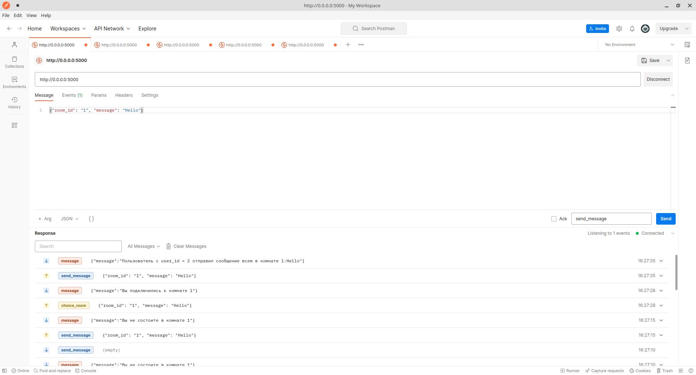

# **Приложение CHAT**

Чат для общения пользователей внутри комнат

## Работа с пользователем

### Подключение
При подключении создается новый пользователь с username = None, он может авторизоваться если у него уже есть "аккаунт".

### Авторизация
Для авторизации нужно отправить событие `auth` с данными в теле запроса {"user_id" : <id его аккаунта>}
Пока никакой защиты аккаунта от входа в него другого человека нет, так что любой человек может зайти на любой аккаунт,
но если в данный момент на этом аккаунте сидит человек ему отправится сообщение об этом.
При авторизации созданный при подключении экземпляр пользователя удаляется и его id добавляется в очередь для присвоения следующему юзеру

_P.S. Если пользователь авторизовался во второй раз, первый аккаунт на который он авторизовался удаляется (в будущем пофиксим)_

### Редактирование профиля
Для изменения имени нужно создать событие с названием `change_name` с данными в теле запроса {"username" : "<имя>"}

### Удаление профиля
Для удаления нужно создать событие с названием `del_user` с любыми данными в теле запроса. После удаления его id 
добавляется в очередь для присвоения следующему пользователю

### Отправка сообщений
Для отправки сообщения в комнату пользователю который ее создал нужно создать событие с названием `send_message` с данными в теле запроса {"room_id" : "<id_комнаты>","message" : "<сообшение>"}.
Для отправки всем {"room_id" : "all","message" : "<сообшение>"}.
Для отправки отдельному пользователю {"user_id" : "<id пользователя>","message" : "<сообшение>"}.

## Работа с комнатами

### Создание комнаты
Для создания комнаты нужно создать событие с названием `create_room` с данными в теле запроса {"room_name" : "<название комнаты>"}
Редактировать и удалять комнату может только пользователь который ее создал.
Всем пользователям отправляется сообщение какой пользователь какую комнату создал

### Подключение к комнате
Для подключения к комнате нужно создать событие с названием `choose_room` с данными в теле запроса {"room_id" : "<id_комнаты>"}
Пользователь получает все сообщения, которые отправляют в комнате, к которой он подключен.

### Список комнат
Для показа списка комнат нужно создать событие с названием `show_rooms` с любыми данными в теле запроса

### Удаление комнаты
Для удаления комнаты пользователю который ее создал нужно создать событие с названием `del_room` с данными в теле запроса {"room_id" : "<id_комнаты>"}.
Всем пользователям в этой комнате приходит уведомление о ее удалении и они отключаются от нее

### Выход из комнаты
Для выхода из комнаты пользователю нужно создать событие с названием `exit_room` с данными в теле запроса {"room_id" : "<id_комнаты>"}.

